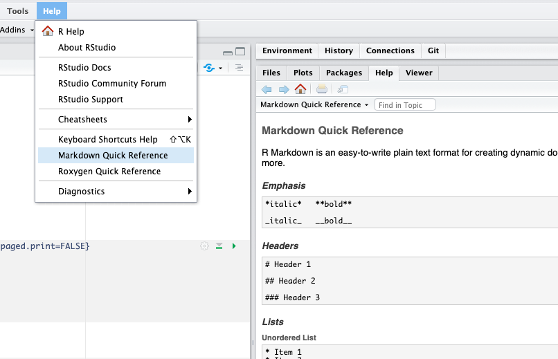

```{r include=FALSE}

library(tidyverse)
library(knitr)
library(gapminder)

mydata = gapminder %>% 
  mutate(gdpPercap = round(gdpPercap)) %>% 
  mutate(pop_millions = (pop/1e6) %>% round(1)) %>% 
  select(-pop)

```

# Set-up {-}

Create a new project and copy this file: 

https://github.com/riinuots/markdown/blob/master/working_document.Rmd

(Right click - Save Link As downloads `working_document.Rmd` on your computer)

# Create HTML/PDF/Word - rendering

## Knit to three different formats

Open `working_document.Rmd` and Knit it into HTML, PDF, and then Word.


**Control+Shift+K** to "knit" the whole Rmd (RMarkdown) document. Or use the Knit button above, and the options there:

{width=200px}


## Set first output back to HTML

Set the output format of `working_document.Rmd` back to html_document by either

a) Press on the Knit button and select "Knit to HTML" again (this moves `html_document` to the top of `output:`).

or

b) editing the YAML* header and moving html_document to the top:

{width=200px}

\* Originally YAML was said to mean Yet Another Markup Language, referencing its purpose as a markup language with the yet another construct, but it was then repurposed as YAML Ain't Markup Language, a recursive acronym, to distinguish its purpose as data-oriented, rather than document markup. (Wikipedia)

## Add automated section numbering to your document

Open the Document Options ("document cog"):

{width=300px}

Tick `Number section headings` for the output formats that it is available for (HTML, PDF):


{width=300px}


# Markdown syntax

## Open the Markdown Quick reference:

{width=600px}

Or look at the  *R Markdown :: Cheat Sheet* for basic Markdown syntax and their effects (reverse: "Pandoc's Markdown").

\clearpage


## New code chunk

Insert a new R code chunk and print a short table in there, e.g. `gapminder %>% slice(1:6)`

{width=150px}

Embrace the three ticks, `{r}`, and investigate the three tiny buttons (chunk cog, run all above, run chunk) top-right of the chunk:

{width=400px}

Note: copying and then editing an existing code chunk (with all its backticks) works really well too.


## Outputting tables, issues with different output formats

If knitting to HTML, your new table and our example table look similar, but if you knit to PDF, you will see that the first table is very nicely formatted, whereas the second one looks like something R would usually print show in the Console.

Solution: Add ` %>% kable()`  to get consistently better formatting in different formats.

```{r, eval = FALSE}
mydata %>% 
  slice(1:6) %>% 
  kable()
```

`kable()` comes from `library(knitr)` which we had loaded at the top anyway.


## Inline R code

We can also include R code inside Markdown sentences using a single \` instead of three:

{width=400px}

### Current time

It can be very useful to include the current time or date in your Markdown document.

Look at the top of your working document - the part called YAML. Replace the currently hard-coded date with with:

```{r, eval = FALSE}
"`r Sys.time()`"
```

Knit your document and see what changed.
 
Bonus:
To change the format of this date/time, wrap `Sys.time()` inside `format()`, e.g., `format('%H:%M %d-%b-%Y')`. Because you're already using double quotes in the date, you'll have to use single quotes inside the `format()` function. So it ends up like this: 

```{r, eval = FALSE}
"`r format(Sys.time(), '%b-%Y')`"
```


Note the difference between the backticks (`) and single ticks (').

Date-time formatting options:

| Notation | Meaning             | Example |
|----------|---------            |---------|
|`%d`        |day as number        |01-31|
|`%A`        |weekday              |Monday-Sunday|
|`%a`        |abbreviated weekday  |Mon-Sun|
|`%m`        |month                |January-December|
|`%b`        |abbreviated month    |Jan-Dec|
|`%Y`        |4-digit year         |2019|
|`%y`        |2-digit year         |19|

(`%H` and `%M` are hour and minute, respectively)

# Chunk options

## Hide messages or warnings

Click on the "chunk cog" to hide messages:

{width=600px}

After you click on the Show messages button, `message = FALSE` appears as a chunk option. (You could also type/copy this into other chunks instead of clicking on the cog.)

Simiarly, to hide warnings for a specific chunk, use the same cog or add `warning = FALSE`.

## Figure size

Go down to the Chunk wehere we create the plot.

Open the chunk cog (same as in the section above) and click on "Use custom figure size". Change the width and height of the plot to, for example, 5x3.

## Setting options for all chunks at once

We can set default options for all our chunks by editing the `knitr::opts_chunk$set(echo = TRUE)` at the top of the document. 

{width=600px}

# Creating a new Markdown document

{width=250px}

Then Save it and give the file a name.

I then usually delete everything below the set-up chunk header and start adding content by copying chunks I've done previously (or from scripts) in there.
