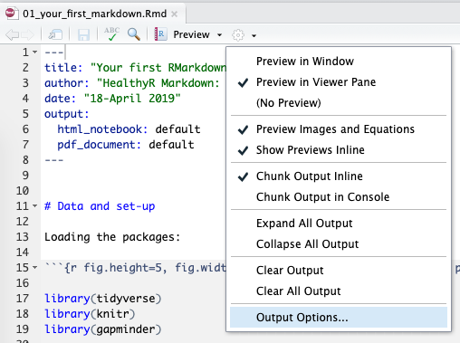
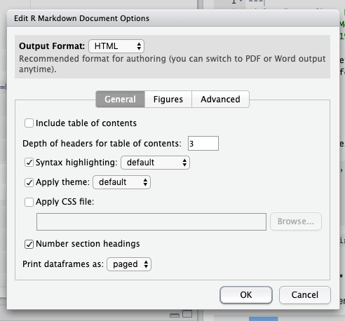
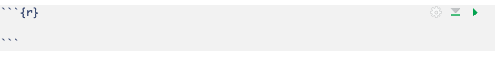
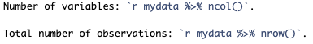
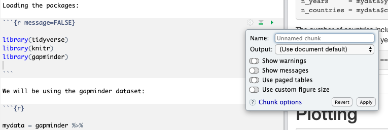
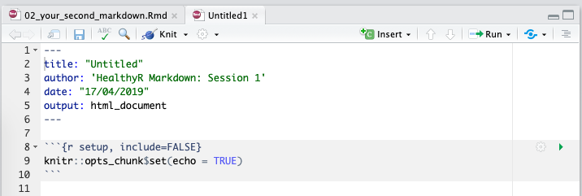
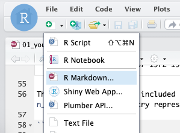

-   [Set-up](#set-up)
-   [Create HTML/PDF/Word - rendering](#create-htmlpdfword---rendering)
    -   [Knit to three different
        formats](#knit-to-three-different-formats)
    -   [Set first output back to HTML](#set-first-output-back-to-html)
    -   [Add automated section numbering to your
        document](#add-automated-section-numbering-to-your-document)
-   [Markdown syntax](#markdown-syntax)
    -   [Open the Markdown Quick
        reference:](#open-the-markdown-quick-reference)
    -   [New code chunk](#new-code-chunk)
    -   [Outputting tables, issues with different output
        formats](#outputting-tables-issues-with-different-output-formats)
    -   [Inline R code](#inline-r-code)
        -   [Current time](#current-time)
-   [Chunk options](#chunk-options)
    -   [Hide messages or warnings](#hide-messages-or-warnings)
    -   [Figure size](#figure-size)
    -   [Setting options for all chunks at
        once](#setting-options-for-all-chunks-at-once)
-   [Creating a new Markdown
    document](#creating-a-new-markdown-document)

Set-up
======

Create a new project and copy this file:

<https://raw.githubusercontent.com/riinuots/markdown/master/working_document.Rmd>

(Right click - Save Link As downloads `working_document.Rmd` on your
computer)

Create HTML/PDF/Word - rendering
================================

Knit to three different formats
-------------------------------

Open `working_document.Rmd` and Knit it into HTML, PDF, and then Word.

**Control+Shift+K** to "knit" the whole Rmd (RMarkdown) document. Or use
the Knit button above, and the options there:

Set first output back to HTML
-----------------------------

Set the output format of `working_document.Rmd` back to html\_document
by either

1.  Press on the Knit button and select "Knit to HTML" again (this moves
    `html_document` to the top of `output:`).

or

1.  editing the YAML\* header and moving html\_document to the top:

\* Originally YAML was said to mean Yet Another Markup Language,
referencing its purpose as a markup language with the yet another
construct, but it was then repurposed as YAML Ain't Markup Language, a
recursive acronym, to distinguish its purpose as data-oriented, rather
than document markup. (Wikipedia)

Add automated section numbering to your document
------------------------------------------------

Open the Document Options ("document cog"):

Tick `Number section headings` for the output formats that it is
available for (HTML, PDF):

Markdown syntax
===============

Open the Markdown Quick reference:
----------------------------------

Or look at the *R Markdown :: Cheat Sheet* for basic Markdown syntax and
their effects (reverse: "Pandoc's Markdown").

New code chunk
--------------

Insert a new R code chunk and print a short table in there, e.g.
`gapminder %>% slice(1:6)`

Embrace the three ticks, `{r}`, and investigate the three tiny buttons
(chunk cog, run all above, run chunk) top-right of the chunk:

Note: copying and then editing an existing code chunk (with all its
backticks) works really well too.

Outputting tables, issues with different output formats
-------------------------------------------------------

If knitting to HTML, your new table and our example table look similar,
but if you knit to PDF, you will see that the first table is very nicely
formatted, whereas the second one looks like something R would usually
print show in the Console.

Solution: Add `%>% kable()` to get consistently better formatting in
different formats.

    mydata %>% 
      slice(1:6) %>% 
      kable()

`kable()` comes from `library(knitr)` which we had loaded at the top
anyway.

Inline R code
-------------

We can also include R code inside Markdown sentences using a single \`
instead of three:

### Current time

It can be very useful to include the current time or date in your
Markdown document.

Look at the top of your working document - the part called YAML. Replace
the currently hard-coded date with with:

    "`r Sys.time()`"

Knit your document and see what changed.

Bonus: To change the format of this date/time, wrap `Sys.time()` inside
`format()`, e.g., `format('%H:%M %d-%b-%Y')`. Because you're already
using double quotes in the date, you'll have to use single quotes inside
the `format()` function. So it ends up like this:

    "`r format(Sys.time(), '%b-%Y')`"

Note the difference between the backticks (\`) and single ticks (').

Date-time formatting options:

<table>
<thead>
<tr class="header">
<th>Notation</th>
<th>Meaning</th>
<th>Example</th>
</tr>
</thead>
<tbody>
<tr class="odd">
<td><code>%d</code></td>
<td>day as number</td>
<td>01-31</td>
</tr>
<tr class="even">
<td><code>%A</code></td>
<td>weekday</td>
<td>Monday-Sunday</td>
</tr>
<tr class="odd">
<td><code>%a</code></td>
<td>abbreviated weekday</td>
<td>Mon-Sun</td>
</tr>
<tr class="even">
<td><code>%m</code></td>
<td>month</td>
<td>January-December</td>
</tr>
<tr class="odd">
<td><code>%b</code></td>
<td>abbreviated month</td>
<td>Jan-Dec</td>
</tr>
<tr class="even">
<td><code>%Y</code></td>
<td>4-digit year</td>
<td>2019</td>
</tr>
<tr class="odd">
<td><code>%y</code></td>
<td>2-digit year</td>
<td>19</td>
</tr>
</tbody>
</table>

(`%H` and `%M` are hour and minute, respectively)

Chunk options
=============

Hide messages or warnings
-------------------------

Click on the "chunk cog" to hide messages:

After you click on the Show messages button, `message = FALSE` appears
as a chunk option. (You could also type/copy this into other chunks
instead of clicking on the cog.)

Similarly, to hide warnings for a specific chunk, use the same cog or
add `warning = FALSE`.

Figure size
-----------

Go down to the Chunk where we create the plot.

Open the chunk cog (same as in the section above) and click on "Use
custom figure size". Change the width and height of the plot to, for
example, 5x3.

Setting options for all chunks at once
--------------------------------------

We can set default options for all our chunks by editing the
`knitr::opts_chunk$set(echo = TRUE)` at the top of the document.

Creating a new Markdown document
================================

Then Save it and give the file a name.

I then usually delete everything below the set-up chunk header and start
adding content by copying chunks I've done previously (or from scripts)
in there.
